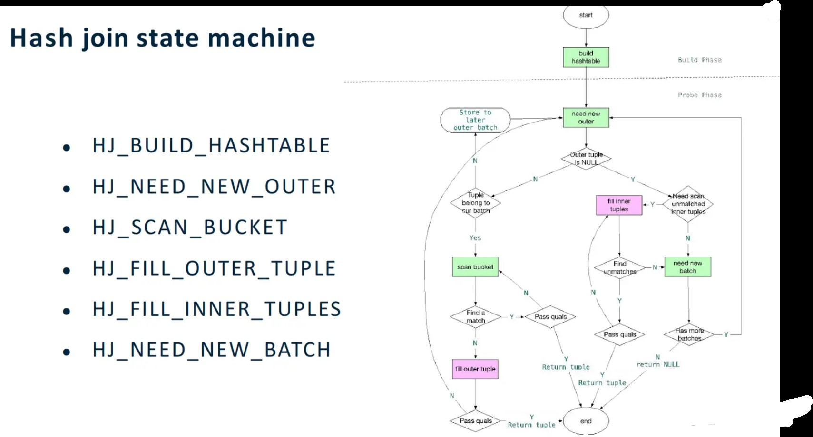

# ass2 
```bash
hewen=# select * from employee
left join salary
on employee.id = salary.id;
INFO:  state: HJ_BUILD_HASHTABLE
INFO:  Hash outer got 1
INFO:  inserting hash value 0x8e731746 into bucket 1862
INFO:  state: HJ_NEED_NEW_INNER
INFO:  Hash inner got 1
INFO:  inserting hash value 0x8e731746 into bucket 838
INFO:  trying 0x8e731746 == 0x8e731746
INFO:  potential 0x56089398bdd8 and 0x560893983d78 as match
INFO:  marked 0x56089398bdd8 and 0x560893983d78 as match
INFO:  **** single match, end
INFO:  state: HJ_PROBE_OUTER
INFO:  out of match
INFO:  state: HJ_NEED_NEW_OUTER
INFO:  Hash outer got 2
INFO:  inserting hash value 0x439edcf6 into bucket 1270
INFO:  state: HJ_NEED_NEW_INNER
INFO:  Hash inner got 2
INFO:  inserting hash value 0x439edcf6 into bucket 246
INFO:  trying 0x439edcf6 == 0x439edcf6
INFO:  potential 0x56089398be08 and 0x560893983da8 as match
INFO:  marked 0x56089398be08 and 0x560893983da8 as match
INFO:  **** single match, end
INFO:  state: HJ_PROBE_OUTER
INFO:  out of match
INFO:  state: HJ_NEED_NEW_OUTER
INFO:  Hash outer got 3
INFO:  inserting hash value 0xfe534f97 into bucket 1943
INFO:  state: HJ_NEED_NEW_INNER
INFO:  Hash inner got 3
INFO:  inserting hash value 0xfe534f97 into bucket 919
INFO:  trying 0xfe534f97 == 0xfe534f97
INFO:  potential 0x56089398be48 and 0x560893983dd8 as match
INFO:  marked 0x56089398be48 and 0x560893983dd8 as match
INFO:  **** single match, end
INFO:  state: HJ_PROBE_OUTER
INFO:  out of match
INFO:  state: HJ_NEED_NEW_OUTER
INFO:  Hash outer got 4
INFO:  inserting hash value 0xc3bc2f2b into bucket 1835
INFO:  state: HJ_NEED_NEW_INNER
INFO:  Hash inner got 4
INFO:  inserting hash value 0xc3bc2f2b into bucket 811
INFO:  trying 0xc3bc2f2b == 0xc3bc2f2b
INFO:  potential 0x56089398be88 and 0x560893983e08 as match
INFO:  marked 0x56089398be88 and 0x560893983e08 as match
INFO:  **** single match, end
INFO:  state: HJ_PROBE_OUTER
INFO:  out of match
INFO:  state: HJ_NEED_NEW_OUTER
INFO:  Hash outer got null
INFO:  state: HJ_NEED_NEW_INNER
INFO:  Hash inner got null
INFO:  state: HJ_FILL_TUPLES
 id | first_name | last_name | department  | id |  salary  
----+------------+-----------+-------------+----+----------
  1 | John       | Doe       | HR          |  1 | 55000.00
  2 | Jane       | Smith     | Engineering |  2 | 60000.00
  3 | Alice      | Johnson   | Finance     |  3 | 50000.00
  4 | david      | ray       | student     |  4 | 48000.00
(4 rows)

hewen=# 
```
# compare of performance
symmetric hash join: 1000 tuple hash join
```bash
992 | First Name 988  | Last Name 988  | Department 4 |  992 | 50992.00
  993 | First Name 989  | Last Name 989  | Department 5 |  993 | 50993.00
  994 | First Name 990  | Last Name 990  | Department 1 |  994 | 50994.00
  995 | First Name 991  | Last Name 991  | Department 2 |  995 | 50995.00
  996 | First Name 992  | Last Name 992  | Department 3 |  996 | 50996.00
  997 | First Name 993  | Last Name 993  | Department 4 |  997 | 50997.00
  998 | First Name 994  | Last Name 994  | Department 5 |  998 | 50998.00
  999 | First Name 995  | Last Name 995  | Department 1 |  999 | 50999.00
 1000 | First Name 996  | Last Name 996  | Department 2 | 1000 | 51000.00
 1003 | First Name 999  | Last Name 999  | Department 5 |      |         
 1001 | First Name 997  | Last Name 997  | Department 3 |      |         
 1002 | First Name 998  | Last Name 998  | Department 4 |      |         
 1004 | First Name 1000 | Last Name 1000 | Department 1 |      |         
(1008 rows)

Time: 176.506 ms
hewen=# 
```

# ass2 handbook

In this assignment, you will impl a new symmetric hash join operator to replace current hashjoin, to impl it, you should modify PostgreSQL's optimizer and executor.

## intro

there are two stage of SymHashJoin:
* building phase: creating hash table
* probing phase: repeatly probing the hashtable that we build, finding if it contains satisfactory tuple or not.

```bash
hewen=# explain select * from employee
left join salary
on employee.id = salary.id;
                               QUERY PLAN                                
-------------------------------------------------------------------------
 Hash Right Join  (cost=32.59..51.28 rows=1004 width=53)
   Hash Cond: (salary.id = employee.id)
   ->  Hash  (cost=16.04..16.04 rows=1004 width=10)
         ->  Seq Scan on salary  (cost=0.00..16.04 rows=1004 width=10)
   ->  Hash  (cost=20.04..20.04 rows=1004 width=43)
         ->  Seq Scan on employee  (cost=0.00..20.04 rows=1004 width=43)
(6 rows)
```

comparing hybrid hash join and symmetric hash join, hybrid hashjoin only create a hash table for inner table, but for symmetric hash join, it uses a build-as-you-go form of probing to find matching data, the steps is:
* read a tuple from the inner realtion, and use inner-realtion-hash-function to calculate its hash value, and insert it into the corresponding bucket of inner hashtable. after that, it use this tuple to probe the outer hash table for any matched tuple with the outer-hash-function.
* the same as tuple from outer realtion
* repeat both operations above until both realtion exhausted.

## points to be modified

1. since the workshop requrie us only using hashjoin instead of nestloop or mergejoin, so we need to turn off them in postgresql.conf
2. since hybrid-hash-join using multiple-batch to handle tuple, we need to turn off it by modifying nodehash.c -> ExecHashTableCreate -> growEnabled.
3. during hash-join, DBMS will turn pathTree into planTree, but in hybrid hash join, it only do it for inner table, so we need to modify it to support both innerTable and OuterTable by modifying createplan.c
4. HashJoinState is a critical data structure in Hash Join process, it maintains hashjoin's state, but in hybrid hash join it only maintian inner table's state. we need to modify it to support both inner and outer in file execnodes.h.
5. nodeHash.c mainly responsible for creating and maintaining hash table, and in hybrid hashjoin, it doesn't impl pipeline-hash-table-creating, so we need to impl it in ExecHash. Besides, we need to modify the code probing hashtable to find matched-value previously. Finally we need to impl function to find the matching value from the inner table and the matching value from the outer table.
6. nodeHash.h containing the nodeHash.c function prototypes, so in this file we need to impl some function, like ExecProbeInnerHashBucketWithOuterTuple and ExecProbeInnerHashBucketWithInnerTuple
7. in the last, we need to modify nodeHashJoin.c, this file mainly responsible for implementing hash join calculation and deciding which value need to join and return. In this file we need to modify threee function:
    * ExecHashJoinImpl: perform node connection return (determine connection)
    * ExecInitHashJoin: initializing the hashjoin state
    * ExecEndHashJoin: Shuttig down the hashJoin state
    * ExecHashJoinImpl: this function impl a state-machine, and we need to modify some state-case.
    
